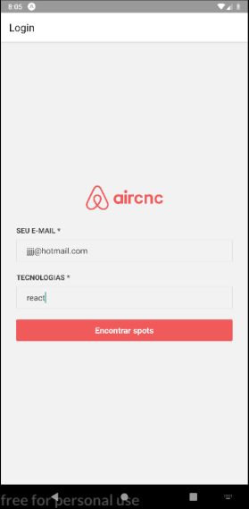
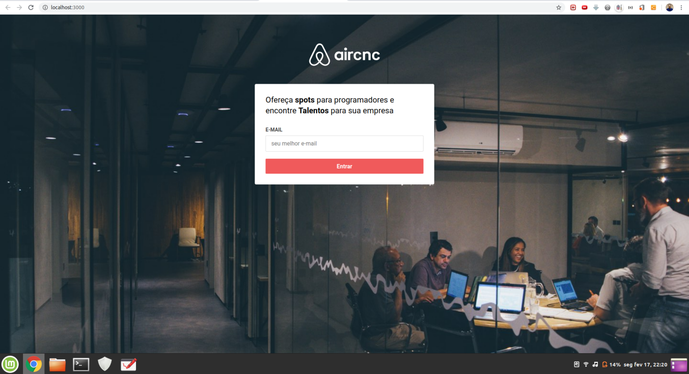

 

Aircnc
☕ Code and coffee
GitHub language count Repository size GitHub last commit Repository issues License

Frontend

Esse projeto foi desenvolvido com as seguintes tecnologias:

Node.js
React
React Native
Expo
computer Projeto

O Aircnc é um projeto que visa conectar empresas que querem abrir spots e desenvolvedores que procuram um lugar para trocar ideias com devs, conhecer a empresa e trabalhar lá por um período.

thinking Como contribuir
Faça um fork desse repositório;
Cria uma branch com a sua feature: git checkout -b minha-feature;
Faça commit das suas alterações: git commit -m 'feat: Minha nova feature';
Faça push para a sua branch: git push origin minha-feature.
Depois que o merge da sua pull request for feito, você pode deletar a sua branch.

memo Licença
Esse projeto está sob a licença MIT. Veja o arquivo LICENSE para mais detalhes.
